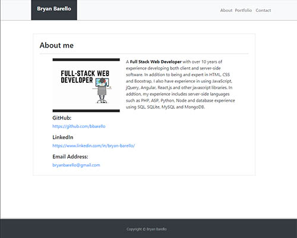

# Portfolio: Bryan Barello

A responsive portfolio of Bryan Barello.

## Description

```
Portfolio was created to be responsive based on viewports of desktop and mobile devices. Contains 4 breakpoints 
at 320px, 640px, 768px and 980px. 

```

## Technologies

```
- HTML
- CSS
- Bootstrap 4
- Responsive Design(RWD)
- Ada Accessibility
- Search Engine Optimization(SEO)

```
## GitHub:
https://github.com/bbarello

## Linkedin:
https://www.linkedin.com/in/bryan-barello/

##  Stagin Link:
https://bbarello.gitthub.io/portfolio/


## Screenshot:



